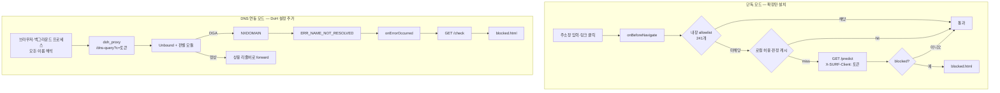

# SURF 구조

구현에서 실제로 알아야 하는 것만 적는다. 배포 절차는 [README](README.md)에 있다.

## 판별 경로가 둘이다

같은 모델을 쓰지만 도메인이 모델까지 도달하는 길이 두 가지고, 각각 막을 수 있는
범위가 다르다.



| | 단독 모드 | DNS 연동 모드 |
|---|---|---|
| 설치 | 확장만 | 확장 + 크롬 DoH 설정 |
| 막는 범위 | 브라우저에서 사용자가 여는 것 | 기기의 모든 이름 해석 |
| 백그라운드 C2 통신 | 못 막는다 | 막는다 |
| 진입 지점 | `background.js` `onBeforeNavigate` | `doh_proxy.py` `/dns-query` |
| 서버 호출 | `/predict` (즉석 추론) | `/check` (차단 기록 조회) |

감염된 PC가 사용자 몰래 C2 도메인을 찾는 질의는 브라우저를 거치지 않는다. 그것을
막는 것은 DNS 계층뿐이고, 단독 모드는 설치 장벽을 없애는 대신 그 범위를 포기한다.
확장의 `CONFIG.PROACTIVE`를 false로 두면 단독 모드만 끄고 DNS 경로를 남길 수 있다.

## 클라이언트를 IP가 아니라 토큰으로 식별한다

허용 상태와 차단 기록은 기기별로 묶여야 한다. 그런데 Cloudflare 터널이나 DoH를
지나면 서버가 보는 주소가 전부 `127.0.0.1`로 뭉개진다. IP를 키로 쓰면 한 사람이
누른 "30분 허용"이 모든 사용자에게 적용된다.

토큰은 확장이 설치 시점에 발급해 `chrome.storage.local`에 넣는다. 두 경로가 각각
다른 방법으로 이 토큰을 서버까지 전달한다.

**HTTP 경로** — 확장이 `X-SURF-Client` 헤더에 실어 보낸다. Flask의 `client_id()`가
헤더, `?c=` 쿼리, `remote_addr` 순으로 찾는다.

**DNS 경로** — Unbound는 HTTP 헤더를 볼 수 없다. 그래서 DoH 프록시가 토큰을 주소로
바꿔서 전달한다.

```
doh_proxy.synthetic_ip("demo01")  ->  127.163.254.19      (sha256 기반, 결정적)
Redis  SETEX tokmap:127.163.254.19  7d  "demo01"
UDP 소켓을 127.163.254.19에 bind 하고 Unbound로 질의

surf_unbound.resolve_client_id("127.163.254.19")
    -> Redis GET tokmap:127.163.254.19
    -> "demo01"
```

리눅스는 `127.0.0.0/8` 전체를 `lo`의 local 라우트로 잡고 있어서 이 대역 어디에나
추가 설정 없이 bind 할 수 있다. 주소 공간이 1600만 개라 충돌은 사실상 없다.

이 방식 때문에 **`doh` 컨테이너가 `unbound`의 네트워크 네임스페이스를 공유해야
한다**(`network_mode: "service:unbound"`). 컨테이너를 분리하면 소스 주소가 도커
네트워크 IP가 되어 `127.` 판정이 깨지고 클라이언트 구분이 통째로 사라진다.

DoH를 함께 쓰는 기기는 확장의 `CLIENT_TOKEN`과 DoH URL의 `?c=` 값이 같아야 한다.

## Redis 키

세 컴포넌트가 같은 Redis를 본다. 키의 `<cid>`는 위에서 정한 토큰이고, 한 곳만
IP로 되돌리면 차단 페이지가 뜨지 않는다.

| 키 | 쓰는 쪽 | 읽는 쪽 | TTL | 용도 |
|---|---|---|---|---|
| `pred:<domain>` | api | api | 6시간 | 판정 캐시. 같은 도메인 반복 추론을 막는다 |
| `block_mark:<cid>:<domain>` | unbound, api | api `/check` | 300초 | NXDOMAIN이 우리 모델 때문인지 판별하는 근거 |
| `allow:<cid>:<domain>` | api `/allow` | unbound, api | 30분 | 임시 허용 |
| `whitelist:<cid>:<domain>` | api `/allow` | unbound, api | 없음 | 영구 허용 |
| `tokmap:<127.x.y.z>` | doh | unbound | 7일 | 소스 주소에서 토큰 복원 |
| `fp_reports` (zset) | api | 운영자 | 없음 | 오탐 신고 누적. allowlist 반영 대상을 뽑는다 |
| `rl:<cid>:<분>` | api | api | 120초 | 분 단위 요청 제한 |

`/allow`는 허용을 기록하면서 `pred:`와 `block_mark:`를 지운다. 남겨두면 허용 직후
재조회에서 다시 막힌다.

## 서버 호출을 줄이는 세 단계

브라우저의 모든 이동마다 모델을 돌리면 지연도 부하도 감당이 안 된다. 세 단계로
거른다.

1. **내장 allowlist** — `whitelist.js`의 도메인 241개. 접미사 매칭이고 서버로
   나가지 않는다. 흔한 사이트 방문 기록이 서버에 남지 않는 부수 효과가 있다.
2. **확장 판정 캐시** — 메모리와 `chrome.storage.session` 2단. 차단 판정은 30분,
   정상 판정은 6시간 들고 있는다.
3. **서버 판정 캐시** — Redis `pred:`. 여러 사용자가 같은 도메인을 열어도 추론은
   한 번이다.

서버가 죽거나 2.5초 안에 답하지 않으면 통과시킨다. 파일럿 중에 서버가 멈췄다고
사용자 브라우징까지 막히면 안 된다.

## 모델 교체

체크포인트마다 어휘 크기, 시퀀스 길이, 위치 인코딩 방식, 분류 헤드 차원, 전처리가
전부 다르다. 하나라도 어긋나면 로드 시점에 shape mismatch로 멈춘다. 그래서
`model_setting.py`의 `VARIANTS`에 한 묶음으로 둔다.

| | `drift` (현재) | `surf-tld` |
|---|---|---|
| subword | 30522 / len 30 | 32393 / len 35 |
| char | 43 / len 77 | 2273 / len 82 |
| positional encoding | 학습형 `nn.Embedding` | 고정 sinusoidal |
| classifier head | `pool` (1024) | `cls` (512) |
| 전처리 | eSLD (`google`) | TLD wrap (`google[.com]`) |
| 가중치 | 공개됨 | 미확보 |

전처리 차이가 특히 조용히 망가진다. DRIFT는 TLD를 뗀 eSLD로 학습되어 있어서
`google.com`을 그대로 넣으면 학습 분포와 어긋나 **모든 도메인이 정상으로 나온다**.
에러가 아니라 판별이 무너지는 방식이라 알아채기 어렵다.

교체는 `artifacts/`에 파일을 넣고 `.env`의 `SURF_MODEL_VARIANT`를 바꾸면 된다.

## 컨테이너 배치

```
cloudflared ──┐ (아웃바운드 연결만, 열린 포트 없음)
              │
   ┌──────────┴───────────┬─────────────┐
   │                      │             │
unbound :53          api :5000    grafana :3000
  + doh :8053          (모델)         ↑
  (같은 netns)                    prometheus :9090
  (모델)                              ↑
   └────────── redis ◄────┴───────────┘
```

`unbound`와 `api`가 모델을 각각 로드하므로 프로세스 메모리에 사본이 둘 생긴다.
RAM 4GB가 최소이고 8GB를 권한다. `doh`는 모델을 싣지 않아 이미지가 260MB다.

배포판 unbound 패키지는 파이썬 모듈이 꺼진 채로 빌드되어 있어 쓸 수 없다.
`--with-pythonmodule`로 직접 빌드하고, 모듈이 도는 인터프리터와 torch를 설치한
인터프리터를 `python:3.11` 하나로 맞춘다.

Prometheus는 세 곳을 따로 수집한다. DNS 경로는 `surf_dns_*`, DoH는 `surf_doh_*`,
확장 단독 경로는 `surf_ext_*`로 이름을 나눠 두었다.
